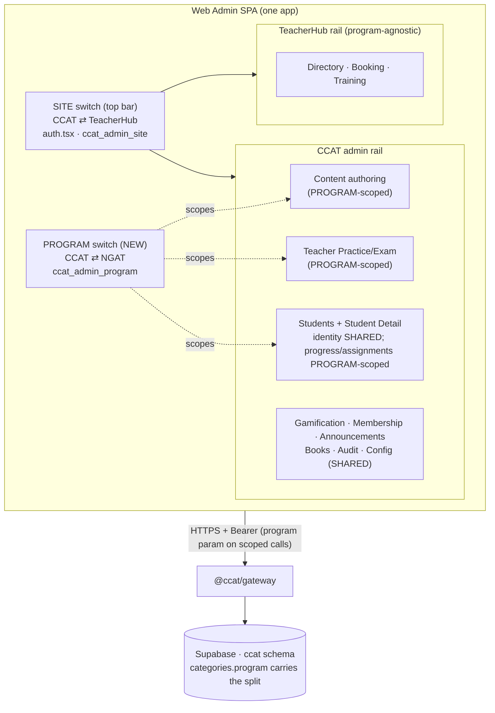
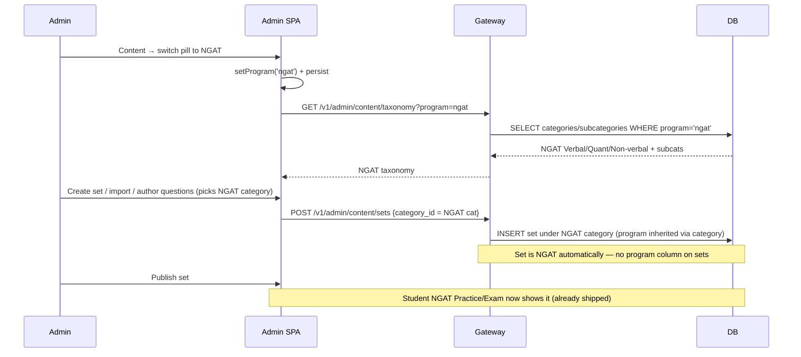
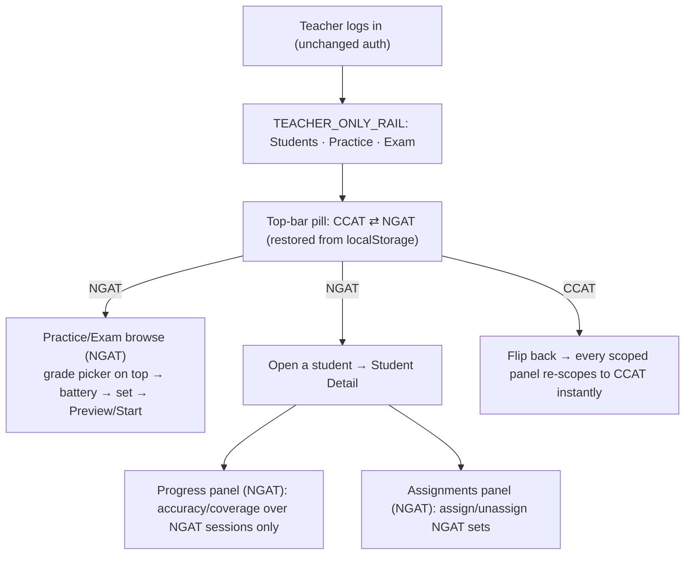

# NGAT in Web Admin — Phase 1 Workflow & Implementation Plan

**Project:** CCAT Practice App — **Web Admin** (`apps/admin`) + Gateway (`apps/gateway`)
**Repo:** `ccat-practice-app-development--new` (monorepo, pnpm workspaces)
**Feature:** Bring the **NGAT** workspace into Web Admin — teacher NGAT Practice/Exam/Progress/Assignments views + admin NGAT content authoring.
**Document type:** Phase 1 plan for review — **no admin/gateway code has been changed yet.**
**Companion:** `NGAT_WORKFLOW.md` (student-web plan) and `NGAT_CHANGES.md` (student-web as-built). Read those first — this doc is the Web Admin counterpart.
**Author:** Claude (Cowork) · **Date:** 2026-10-01
**Status:** DRAFT for Ankita's review → approve before any code is written.

---

## 0. How to read this document

This is the single source of truth for the **Web Admin** NGAT build. It is deliberately detailed so you can approve the approach before code is written, any implementer can follow it step by step, and later debugging reads this file + the post-build `NGAT_WEBADMIN_CHANGES.md` instead of re-scanning the repo.

Everything below is grounded in the **actual current code** (real file paths, symbol names, and line numbers as of 2026-10-01). External facts and figures are flagged where they occur.

> **One thing to internalise before anything else (Section 2):** Web Admin already has a `CCAT Practice | TeacherHub` switcher. That is the **SITE** dimension. NGAT is a **different** dimension (**PROGRAM**). They are orthogonal and must not be merged. Getting this wrong breaks both.

---

## 1. Decisions locked (your answers — 2026-10-01)

| # | Decision | Your choice | Effect on this plan |
|---|----------|-------------|---------------------|
| 1 | **Admin** switcher placement | **In-page pills in the Content section** (not a second global top-bar pill) | The CCAT⇄NGAT program toggle renders as pills inside Content / Exam papers / Import pages only. No clash with the existing top-bar site pill. |
| 2 | **Teacher-role** account scope | **Top-bar NGAT switcher** scoping Practice/Exam browse + the per-student progress & assignments panels in Student Detail | Reuses existing screens; no new teacher rail pages. Teacher accounts have no site pill, so a top-bar program pill there is unambiguous. |
| 3 | Gating (who sees NGAT in admin) | **All content admins + all teachers — no allow-list** | Admin switcher is always visible. The student app keeps its own `ngat_enabled` allow-list for students; that flag is **not** reused on the admin side. |
| 4 | Content authoring scope at launch | **Full 3-battery NGAT authoring** (Verbal + Quantitative + Non-verbal) | Requires a new seed migration adding the NGAT **Quantitative** and **Non-verbal** categories (+ subcategories). Only NGAT Verbal/Part A/B/C exists today. See §6.1 and the one content input in §11-A. |

> **Non-negotiable constraints (carried from the student brief):** the CCAT **login/auth is not touched**; every scoped endpoint **defaults to `program='ccat'`** so mobile and un-updated clients are unaffected.

---

## 2. The two dimensions — the single most important concept

Web Admin now has **two independent switching dimensions**. They are different axes and must stay separate.

| | **SITE** dimension (exists today) | **PROGRAM** dimension (this build) |
|---|---|---|
| Values | `ccat` ⇄ `teacher` (TeacherHub) | `ccat` ⇄ `ngat` |
| What it switches | Which **back-office** you are in (CCAT admin vs TeacherHub admin — different rails, different pages) | Which **student-content workspace** a content/teacher view is showing |
| Where it lives | `lib/auth.tsx` → `activeSite`/`switchSite`; persisted `localStorage['ccat_admin_site']`; rendered as the top-bar pill + mobile drawer in `components/Layout.tsx` | **NEW** → a `program` state; persisted `localStorage['ccat_admin_program']`; rendered as in-page Content pills (admins) and a top-bar pill (teacher accounts) |
| Who sees it | Non-teacher admins with `teacher.*` perms or `super_admin` | All content admins (Content pages) + all teacher accounts |
| Backend coupling | A real `ccat.sites` table (`0048_sites_scoping.sql`), teacher.* permissions | The existing `ccat.categories.program` column (`0054_ngat_program.sql`) |

**Rule:** the PROGRAM pill only ever appears on **program-scoped surfaces** (Content authoring; teacher Practice/Exam; per-student progress/assignments). It never appears on the TeacherHub site, on Students directory, on Gamification, Announcements, Audit, Config, Membership, Admin accounts — those are program-agnostic or shared.

---

## 3. Current architecture (what exists today)

### 3.1 Monorepo (confirmed live)

```
ccat-practice-app-development--new/
├── apps/
│   ├── web/      @ccat/web      — CCAT student SPA (NGAT already shipped — see NGAT_CHANGES.md)
│   ├── admin/    @ccat/admin    — Web Admin SPA (Vite+React) → Vercel   ← this build's target
│   ├── gateway/  @ccat/gateway  — Fastify API (the only backend clients talk to) → Render
│   └── mobile/   @ccat/mobile   — React Native (out of scope)
└── packages/
    ├── api-client/  shared DTO types + HTTP client
    ├── contracts/   SQL migrations (DB source of truth) + OpenAPI
    ├── client-core/ framework-agnostic helpers
    └── shared/
```

Deployed: Admin → `https://admin.conceptmastery.com` (`<title>CCAT Admin Console</title>`); Student → `https://ccat.conceptmastery.com`. DB: Supabase Postgres, schema `ccat` (project ref `wazutprwrhnabjfggghp`). Data flow: **Admin SPA → Gateway → Supabase**; the admin never touches the DB directly.

### 3.2 Admin app shape (`apps/admin/src`)

- `main.tsx` → `AuthProvider` (`lib/auth.tsx`) → `App` (`App.tsx`, route table + role gating).
- `components/Layout.tsx` — left rail + top bar; holds the **site** switcher and the notification bell. Rail is chosen by `railForSite(activeSite)`: `RAIL` (CCAT) vs `TEACHER_RAIL` (TeacherHub). Teacher-role accounts (`me.is_teacher`) get `TEACHER_ONLY_RAIL`.
- `lib/auth.tsx` — `me`, `can(perm)`, and the **site** state (`sites`, `activeSite`, `switchSite`).
- `lib/api.ts` — the single typed gateway client (`api.*`); token in `sessionStorage`, refresh in `localStorage`.
- `pages/*.tsx` — one file per screen.

### 3.3 Two kinds of "teacher" — do not confuse them

| Term | What it is | Rail / routes |
|---|---|---|
| **TeacherHub** (site) | A back-office **site** for staff: teacher directory, booking links, leave, **staff training** (modules/roleplays), teacher-training progress. | `TEACHER_RAIL`, routes `/teacherhub/*`. **Program-agnostic — out of scope for NGAT.** |
| **Teacher-role account** (`me.is_teacher`) | A tutor who logs into Web Admin and is **locked** to: Students directory, read-only Student Detail, and **Practice/Exam browse** (`/teacher-practice`, `/teacher-exam`). | `TEACHER_ONLY_RAIL` (Students · Practice · Exam). Routes gated in `App.tsx`. **This is the NGAT target for decision #2.** |

> `TeacherProgress.tsx` = TeacherHub **staff-training** progress (`/teacherhub/training/progress`). It is **not** student NGAT progress. Student NGAT progress is viewed inside **Student Detail** (`StudentDetail.tsx`). Don't wire NGAT into the training page.

### 3.4 How the NGAT-relevant admin surfaces work today

**Content authoring (regular admins).** Rail item **Content** → `Content.tsx` (`/content`, practice sets), `ExamPapers.tsx` (`/content/exams`), `ImportQuestions.tsx` (`/content/import`), `LearningPlans.tsx`. Backed by gateway `admin-content.ts` + `admin-content-authoring.ts`. The authoring taxonomy comes from `GET /v1/admin/content/taxonomy`.

**Teacher Practice/Exam browse.** `TeacherContent.tsx` exports `TeacherPractice`/`TeacherExam` (routes `/teacher-practice`, `/teacher-exam`; available to both regular admins and teacher accounts). It calls `api.teacherCatalog(gradeId)` → `GET /v1/admin/teacher/catalog?grade_id=` and `api.teacherSetPreview(setId)` → `GET /v1/admin/teacher/set-preview`. Grade is chosen on top (teacher isn't tied to one grade). Battery order is hardcoded `['verbal','quantitative','non_verbal']`; only batteries with sets render.

**Per-student progress + assignments.** `StudentDetail.tsx` panels call `GET /v1/admin/students/:id/progress/{summary,sets,set-review}` and `GET /v1/admin/students/:id/assignments` + `.../assignments/catalog`, plus POST/DELETE to assign/unassign.

### 3.5 The content & learning data model (the part that makes this cheap)

Hierarchy: **Grade → Category → Subcategory → Question Set → Set Version → Question Version.** Every learner/content artefact (set, session, assignment, completion, progress bucket) roots back to a **category** through the set. Migration `0054_ngat_program.sql` put the `program` flag **on `ccat.categories`**, so the CCAT/NGAT split **propagates to all of them through the category join** with no changes to busy tables. The admin build rides the exact same column.

---

## 4. What's already done vs what this build adds

| Layer | Already shipped (student-web build, `NGAT_CHANGES.md`) | This build adds (Web Admin) |
|---|---|---|
| **DB** | `categories.program` + `unique(program,key)` + check + index; NGAT **Verbal**/Part A/B/C scaffold (no sets) | **Seed NGAT Quantitative + Non-verbal categories (+ subcategories)** for full 3-battery authoring (decision #4) |
| **Gateway (student endpoints)** | `?program` on `/v1/catalog`, `/v1/progress/*`, `/v1/assignments`, `/v1/bookmarks`, `/v1/exams/history`; `profile.ngat_enabled` | **Admin endpoints**: thread `program` through teacher-catalog, admin content/exam/import/taxonomy, admin per-student progress/assignments, admin set lists |
| **Admin (pinned to CCAT on purpose)** | `admin-content.ts` + `admin-content-authoring.ts` category reads **pinned `program='ccat'`** so admin couldn't touch NGAT | **Un-pin behind a `program` param** and add the switchers + UI wiring |
| **Admin SPA** | — | `program` state + persistence; Content in-page pills; teacher top-bar pill; wire into Content/Exam/Import/TeacherContent/StudentDetail |

**The CCAT-pins that must be addressed (real locations):**

- `apps/gateway/src/routes/admin-content.ts:254-255` — `GET /v1/admin/content/taxonomy` and the category read are `where active and program = 'ccat'`.
- `apps/gateway/src/routes/admin-content-authoring.ts:390` — import category resolve `where active and program='ccat'`.
- `apps/gateway/src/routes/admin-content-authoring.ts:484-485` — exam-paper author anchor `where key='verbal' and active and program='ccat'` (+ fallback first-category also pinned).

**The admin endpoints that currently have NO program filter and would LEAK NGAT into CCAT views once NGAT sets exist (real locations):**

- `apps/gateway/src/routes/admin-students.ts:426` — `GET /v1/admin/teacher/catalog` joins `ccat.categories` with no program predicate.
- `apps/gateway/src/routes/admin-students.ts:180` — `GET /v1/admin/students/:id/assignments` (list) — category join, no program filter.
- `apps/gateway/src/routes/admin-students.ts:249` — `.../assignments/catalog` — no program filter.
- `apps/gateway/src/routes/admin-content.ts:358` — `GET /v1/admin/content/sets` (set list) — needs a program filter so the CCAT set browser doesn't show NGAT sets.
- Per-student progress (`admin-students.ts:140/146/156`) calls `computeProgressSummary`/`computeProgressSets` (which already accept `program`, default `ccat`) — currently called **without** `program`, so they return CCAT. Thread `program` through.
- `GET /v1/admin/teacher/set-preview` (`admin-students.ts:467`) — program is implied by `setId`; **no change needed** (correct by design).

---

## 5. Shared vs Separate inside Web Admin — the core contract

| Admin capability | Shared or Program-scoped | Where enforced |
|---|---|---|
| Students directory, Student Detail identity | **Shared** | `ccat.students` — unscoped; one student across both programs |
| Admin accounts & permissions, Audit log | **Shared** | unscoped governance |
| Gamification (achievements/avatars/themes/economy) | **Shared** | unscoped — coins/XP/achievements span both programs |
| Membership / entitlements | **Shared** | one plan; no per-program paywall in admin (matches student side) |
| Announcements, Book store | **Shared** | unscoped comms |
| Config → Grades / Flags | **Shared** | unscoped |
| TeacherHub site (directory, booking, training) | **Shared / N/A** | program-agnostic; NGAT pill never appears here |
| **Content authoring** (sets, questions, exam papers, import, taxonomy) | **Separate** | category/taxonomy reads + set lists filtered by `program` |
| **Teacher Practice/Exam browse** | **Separate** | `teacher/catalog` filtered by `program` |
| **Per-student Progress panels** | **Separate** | `progress/*` computed within one `program` |
| **Per-student Assignments** | **Separate** | assignment list/catalog filtered via set→category→`program` |

**Design rule (same one sentence as the student side):** anything **shared** stays exactly as-is (no `program`); anything **separate** gains a single `program` scoping dimension that defaults to `ccat`.

---

## 6. Target architecture (with NGAT in Web Admin)

### 6.1 Database — one new seed migration

The structural work (`program` column, unique, NGAT Verbal scaffold) is **already done** in `0054`. For **full 3-battery** authoring (decision #4) we only need to add the two missing NGAT categories + their subcategories.

**New migration `0055_ngat_full_batteries.sql`** (additive, idempotent, structure-only — no sets, no questions):

1. Insert NGAT categories `quantitative` (name "Quantitative Reasoning", `program='ngat'`, `display_order` 20) and `non_verbal` ("Non-verbal Reasoning", `display_order` 30) — `on conflict (program,key) do update ... active=true` (mirrors the `0054` pattern).
2. Insert their subcategories. **⚠️ subcategory names are the one content input needed — see §11-A.** Safe interim: mirror CCAT's existing subcategory keys for those batteries, or launch each NGAT battery flat (one default subcategory) and refine later.
3. No RLS change (adding category rows doesn't alter policies; `0006_rls_and_grants.sql` / `0025_rls_backfill.sql` govern reads and already handle `categories`). Verify catalog/taxonomy reads still pass after seeding (§10).

> If you'd rather launch Verbal-only after all, skip `0055` entirely — everything else in this plan still works; the Content pills just show Verbal under NGAT until the other batteries are seeded.

### 6.2 Gateway — thread one `program` param (default `ccat`)

Pattern everywhere: read `program` from the query (coerce to `'ngat'` only when exactly `'ngat'`, else `'ccat'` — the same guard already used in `assignments.ts:14`), and add one `and cat.program = $program` to the category-joined query. Shared routes untouched.

| Route file · symbol | Change |
|---|---|
| `admin-content.ts` · `GET /v1/admin/content/taxonomy` (254) | Accept `?program`; return that program's categories/subcategories. **This is the master gate** — the authoring UI builds every category/subcategory picker from taxonomy, so once this is program-aware, created sets inherit the program through the chosen `category_id`. |
| `admin-content.ts` · category read (255) | `program = $program` instead of literal `'ccat'`. |
| `admin-content.ts` · `GET /v1/admin/content/sets` (358) | Add `?program`; filter the set list via category join so each program's set browser is isolated. |
| `admin-content-authoring.ts` · `POST /v1/admin/content/import` (381, cats at 390) | Accept `program`; resolve category names within that program. |
| `admin-content-authoring.ts` · `POST .../exam-papers/scaffold` + `POST .../sets/:id/author` anchor (484-485) | Accept/propagate `program`; the `key='verbal'` anchor must resolve within the chosen program, not literal `ccat`. |
| `admin-content-authoring.ts` · `POST /v1/admin/content/sets` (114) | Verify it uses the client-supplied `category_id` (from program-aware taxonomy) and has no hidden `program='ccat'` pin. If clean, **no change** — the set is NGAT automatically because its category is. (Verification item, §10.) |
| `admin-students.ts` · `GET /v1/admin/teacher/catalog` (426) | Accept `?program`; add `and cat.program = $program`. Default `ccat`. |
| `admin-students.ts` · `GET /v1/admin/students/:id/assignments` (180) + `.../assignments/catalog` (249) | Accept `?program`; filter via set→category→program. Default `ccat`. |
| `admin-students.ts` · `GET /v1/admin/students/:id/progress/{summary,sets}` (140,146) | Thread `program` into `computeProgressSummary`/`computeProgressSets` (they already take it). `set-review` stays unscoped (setId implies program). Default `ccat`. |
| `admin-students.ts` · `GET /v1/admin/teacher/set-preview` (467) | **No change** — program implied by `setId`. |

Untouched (shared): `admin-accounts.ts`, `admin-rewards.ts`, `admin-economy.ts`, `admin-entitlements.ts`, `admin-comms.ts`, `admin-ops.ts`, `admin-config.ts`, `admin-dashboard.ts`, `admin-teacher.ts` (booking/leave/training), `auth.ts`.

> **Backward-compat guarantee:** every scoped admin endpoint defaults `program='ccat'`. Any un-updated caller (and the student `/v1/*` endpoints, already shipped) behaves exactly as today.

### 6.3 Shared client (`packages/api-client` + `apps/admin/src/lib/api.ts`)

- Reuse the existing `Program = 'ccat' | 'ngat'` type and `withProgram()` helper already added to `@ccat/api-client` in the student build (`NGAT_CHANGES.md §3.3`).
- In `apps/admin/src/lib/api.ts`, add an optional `program?: Program` arg to: `taxonomy`, `sets`, `createSet`/`authorSet` (only if a pin is found), content `import`, exam scaffold, `teacherCatalog`, `getStudentAssignments`, `getStudentAssignmentsCatalog`, and the three student-progress calls. Omitted ⇒ `ccat` (today's behaviour).

### 6.4 Admin SPA (`apps/admin/src`)

**(a) Program state — new, separate from site state.** Add a small `program` context (or extend `auth.tsx`) with `program: Program` + `setProgram(p)`, initialised from `localStorage['ccat_admin_program']` (fallback `'ccat'`). Keep it **completely separate** from `activeSite`/`switchSite`. Writing through to localStorage mirrors the site switcher's pattern.

**(b) Admin Content pills (decision #1).** A `ContentProgramPills` component — segmented `[ CCAT · NGAT ]` — rendered at the top of `Content.tsx`, `ExamPapers.tsx`, and `ImportQuestions.tsx` (and `LearningPlans.tsx` only if you later scope plans). On switch → `setProgram(x)` and refetch taxonomy/sets for the new program. Visual: reuse the in-page pill style already used for the Practice/Exam toggle in Content (mockup convention). Always visible (no allow-list, decision #3).

**(c) Teacher top-bar pill (decision #2).** In `components/Layout.tsx`, render a `[ CCAT · NGAT ]` pill in the top bar `.who` region **only when** `me?.is_teacher` (teacher accounts have no site pill, so there's no collision) **and** the current route is program-scoped (`/teacher-practice`, `/teacher-exam`, `/students`, `/students/:id`). It drives the same `program` state.
  - For **regular admins**, do **not** add a top-bar program pill (decision #1 keeps theirs in-page). Regular admins browsing `/teacher-practice` use the in-page grade selector already there; add a small in-page program pill on `TeacherContent` too so they can preview NGAT content — consistent with "admins get in-page pills."

**(d) Wire `program` into scoped screens.**
  - `TeacherContent.tsx` → `api.teacherCatalog(gradeId, program)`; battery order already includes all three, empty batteries already auto-hide, so NGAT shows only seeded batteries. Reset browse position on switch.
  - `Content.tsx` / `ExamPapers.tsx` / `ImportQuestions.tsx` → pass `program` to `taxonomy`, `sets`, import, exam scaffold, author.
  - `StudentDetail.tsx` → the Progress panels and Assignments panel read the active `program`; when a teacher/admin flips the pill, these panels refetch for that program (a student's CCAT vs NGAT progress/assignments shown per the active workspace).

**(e) Branding.** Where a sub-label or section title would help, reflect the active program ("NGAT" tag) on the scoped pages — trivial string from `program`. Don't touch the brand header (that reflects **site**).

### 6.5 Explicitly NOT changed in this phase

- CCAT/admin **auth & login** — untouched.
- TeacherHub **site** (directory, booking links, leave, staff **training**/roleplays, teacher-training progress) — program-agnostic, untouched.
- Shared admin areas — Students directory, Gamification, Membership, Announcements, Books, Audit, Config, Admin accounts — untouched.
- **Mobile app** — untouched (no `program` param → sees CCAT).
- Student SPA (`apps/web`) — already shipped; untouched here.

---

## 7. Diagrams

### 7.1 The two dimensions inside Web Admin



### 7.2 NGAT content authoring — request flow



### 7.3 Teacher NGAT cycle



---

## 8. Complete admin + teacher NGAT cycle (narrative)

**Admin content author:** signs in → **Content** → flips the in-page pill to **NGAT** → taxonomy repopulates with NGAT batteries/subcategories → creates sets / imports questions / scaffolds exam papers exactly as for CCAT, but everything lands under NGAT categories → publishes. Published NGAT sets immediately appear in the student NGAT workspace (already shipped) and in the teacher NGAT browse. Flipping back to **CCAT** returns the normal CCAT authoring view, untouched.

**Teacher:** signs in (locked rail) → top-bar pill restores last workspace → in **NGAT**, **Practice/Exam** browse shows only NGAT content (pick grade on top; empty batteries auto-hide) → **Preview** shows questions with answers; **Start** runs the in-browser ungraded preview (existing behaviour). Opening a student shows that student's **NGAT** progress and lets the teacher assign **NGAT** sets. Flip to **CCAT** → all panels re-scope instantly. Shared data (the student's identity, coins, XP, achievements) is identical in both.

---

## 9. Content upload workflow for NGAT (step by step)

This is the "admins can upload content for the NGAT workspace" requirement, concretely:

1. **Taxonomy must exist first.** NGAT Verbal/Part A/B/C exists (`0054`). For Quant/Non-verbal, run `0055` (§6.1) — else those pills show empty under NGAT.
2. Admin opens **Content**, flips pill → **NGAT**.
3. **Create a set** (`Content.tsx` → `createSet`) picking an NGAT grade + NGAT category + subcategory (from NGAT taxonomy). The set is NGAT because its category is.
4. **Add questions** — either `authorSet` (Google-Forms-style batch) or `ImportQuestions.tsx` bulk import (program-aware category resolve). Same 0..100 per-set cap as CCAT.
5. **Exam papers** — `ExamPapers.tsx` → `exam-papers/scaffold` with the NGAT single-battery anchor resolving within NGAT.
6. **Publish** (`sets/:id/publish`). Publish/retire/immutability rules are unchanged (they don't depend on program).
7. Verify in the student NGAT workspace and the teacher NGAT browse.

No new authoring UI is built — the existing set/question/exam/import tools are reused, gated by the program pill. That is the whole point of putting `program` on `categories`.

---

## 10. Implementation steps (ordered checklist)

Ordering: **DB → gateway → shared client → admin SPA → verify.** Items needing you are flagged ⚠️.

**Stage A — Database**
1. Write `0055_ngat_full_batteries.sql` (NGAT Quant + Non-verbal categories + subcats). ⚠️ needs subcategory names (§11-A).
2. Run locally against the docker DB; confirm CCAT taxonomy/catalog unchanged; confirm 4 NGAT categories now exist (verbal+quant+non_verbal) with correct subcats.

**Stage B — Gateway**
3. Thread `program` (default `ccat`) through: `taxonomy`, content `sets` list, `import`, exam scaffold + author anchor, `teacher/catalog`, per-student `assignments` + `assignments/catalog`, per-student `progress/{summary,sets}`.
4. Un-pin the literal `program='ccat'` reads (`admin-content.ts:255`, `admin-content-authoring.ts:390,484-485`) to use the param.
5. Confirm `POST /v1/admin/content/sets` has no hidden CCAT pin (verification); fix if found.
6. Gateway tests: for each scoped endpoint assert `omitted == ccat` byte-identical to today, and `program=ngat` returns only NGAT rows.

**Stage C — Shared client**
7. Add optional `program` to the relevant `apps/admin/src/lib/api.ts` methods (reuse `@ccat/api-client` `withProgram`). Typecheck.

**Stage D — Admin SPA**
8. Add `program`/`setProgram` state + `localStorage['ccat_admin_program']` (separate from site state).
9. `ContentProgramPills` in Content/Exam/Import (+ in-page pill on TeacherContent for admins). ⚠️ none; decision #1 locked.
10. Teacher top-bar pill in `Layout.tsx` gated to `me.is_teacher` + scoped routes.
11. Wire `program` into `TeacherContent`, `Content`, `ExamPapers`, `ImportQuestions`, and `StudentDetail` progress/assignments panels. Reset browse position on switch.
12. Program tag on scoped page headers.

**Stage E — Verify (§ below)**
13. Local E2E: author an NGAT Verbal set → publish → teacher NGAT browse shows it → assign to a student → student's NGAT progress/assignments reflect it → flip to CCAT → CCAT content & that student's CCAT data intact.
14. Regression: with the pill never touched, every admin surface behaves exactly as before.

**Stage F — Handoff**
15. Produce `NGAT_WEBADMIN_CHANGES.md` (as-built — see §13).
16. ⚠️ **You** run `0055` on production Supabase and **you** do the git push (per brief). I provide exact commands.

---

## 11. Verification plan

| Check | Method | Pass criteria |
|---|---|---|
| Migration safe | Run `0055` on a DB copy | No error; existing rows unchanged; 4 NGAT categories present with subcats |
| CCAT regression | Use admin, never touch any NGAT pill | Content/Exam/Import, teacher browse, student progress/assignments identical to pre-change |
| Taxonomy scoping | `taxonomy?program=ngat` vs `?program=ccat` | Each returns only its program's categories; omitted == ccat |
| Authoring lands NGAT | Create+publish a set with pill on NGAT | Set appears only in NGAT browser + student NGAT workspace, never in CCAT |
| Set-list isolation | `/content/sets?program=ngat` | Only NGAT sets; CCAT list unchanged |
| Teacher catalog | `teacher/catalog?program=ngat` | Only NGAT published sets for the grade |
| Per-student scope | Flip pill on a student with both-program activity | Progress + assignments switch between CCAT-only and NGAT-only figures |
| Gateway contract | tests omitted / `=ccat` / `=ngat` | omitted == ccat; ngat returns only NGAT rows |
| Persistence | Flip to NGAT, reload | Admin reopens scoped views in NGAT; **site** switcher unaffected |

For DB/gateway I'll diff query outputs before/after on the local docker DB; for UI I'll walk the full cycle (screenshots in the handoff doc).

---

## 12. Open items — decision / input needed from you

- **A. NGAT Quantitative & Non-verbal subcategory names (blocks only the `0055` seed).** Decision #4 = full 3-battery authoring, but only NGAT Verbal (Part A/B/C) is defined today. Give me the subcategory names for NGAT **Quantitative** and **Non-verbal**, OR say "mirror the CCAT subcategories for those batteries," OR "launch each flat (one default subcategory), refine later." Nothing else is blocked by this.
- **B. Learning plans under NGAT?** `LearningPlans.tsx` / `/v1/admin/content/learning-plans` is currently CCAT-oriented and the student side notes legacy `/v1/progress` learning-plan coverage is **not** program-scoped. Recommendation: **leave learning plans CCAT-only this phase** (NGAT has none). Confirm, or say you want them scoped now.
- **C. Should regular admins also be able to *assign* NGAT sets to students, or only author?** The per-student assignment panel is in Student Detail (used by admins and teachers). Recommendation: **yes, scope it by program for both** (one code path). Confirm.

*(None of A–C blocks writing the switchers, state, gateway params, or the `0055` column seed with placeholder subcats. A is the only one that changes what the first NGAT authoring screen shows.)*

---

## 13. Things only you can do

- **Run `0055` on production Supabase** and **push to Git** — per brief, you own both. I'll hand over exact `pnpm migrate` / Supabase + `git` commands and the migration file.
- Provide NGAT Quant/Non-verbal subcategory names (or approve a fallback) — §11-A.
- Confirm §12 B and C.
- Redeploy after code lands: `apps/admin` → Vercel; `apps/gateway` → Render; DB seed → Supabase (no redeploy).

---

## 14. Post-implementation reference (second Markdown — after approval + build)

After code is written and verified I'll produce **`NGAT_WEBADMIN_CHANGES.md`** at the repo root (mirrors `NGAT_CHANGES.md`): file-by-file changes with the migration number, feature status, how each works, final shared-vs-separate, and known issues. That becomes the debugging/continuation reference so the repo isn't re-scanned next time.

---

## 15. Summary for review

- **Two dimensions, kept separate:** existing **site** pill (CCAT/TeacherHub) ≠ new **program** pill (CCAT/NGAT). The program pill is in-page for admins (Content), top-bar for teacher accounts.
- **Almost all the backend already exists:** `categories.program` + the student endpoints shipped. This build mainly **un-pins the admin from CCAT** and threads one `program` param through a handful of admin endpoints (all default `ccat` → zero regression).
- **DB delta is one small seed** (`0055`) to add NGAT Quant + Non-verbal, needed only because you chose full 3-battery authoring.
- **No new authoring UI, no new routes, no forked screens, auth untouched.** Content tools and teacher screens are reused, gated by the pill.
- **Shared** (student identity, economy, rewards, achievements, membership, announcements, audit, TeacherHub) stays one set of data; **separate** (content authoring, teacher browse, per-student progress/assignments) is cleanly scoped by `program`.

**Awaiting your approval + §12-A (subcategory names) before any Web Admin code is written.**
