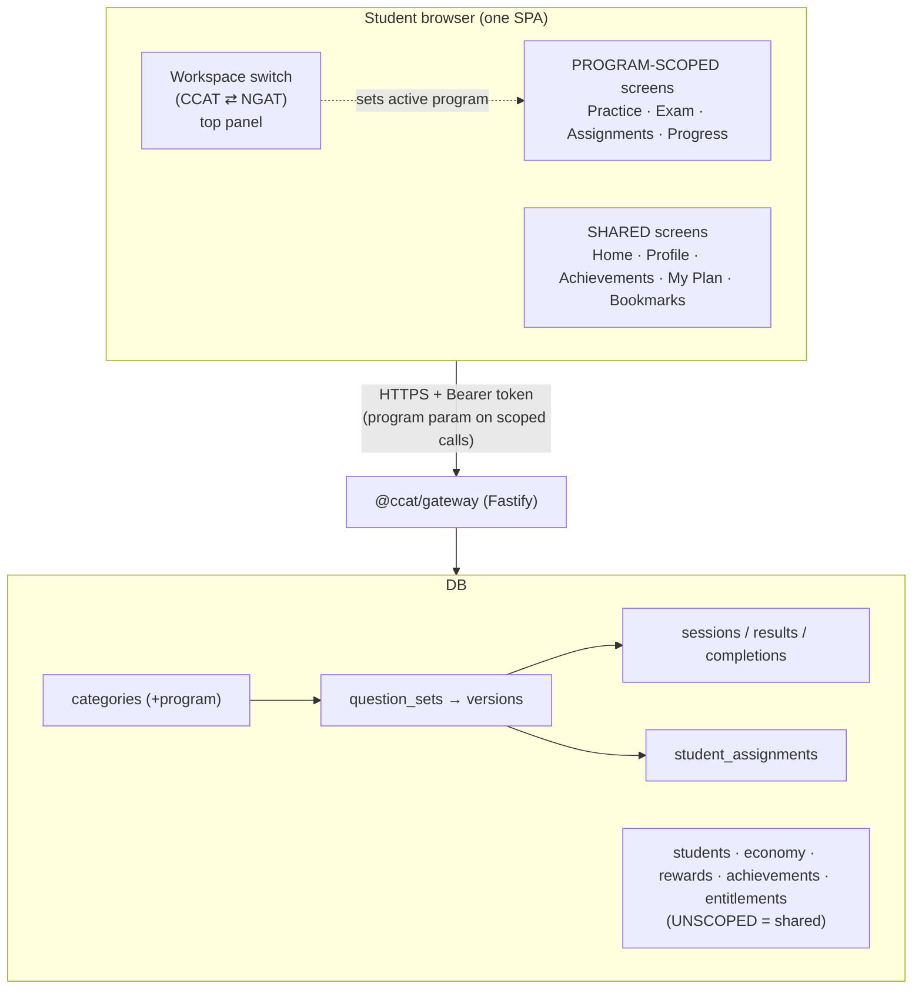
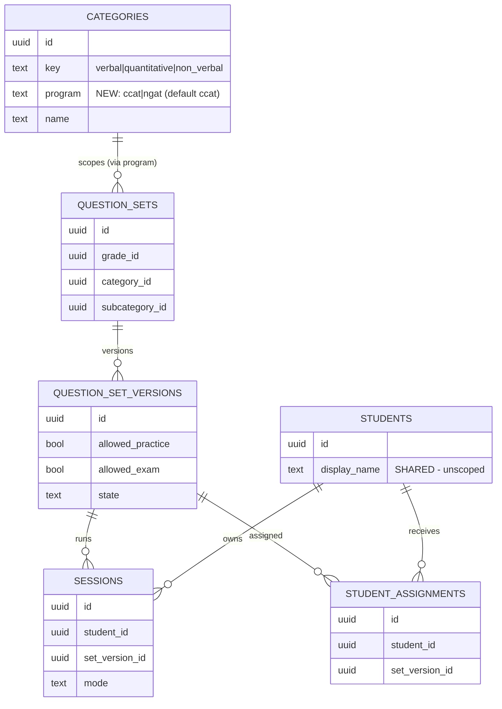
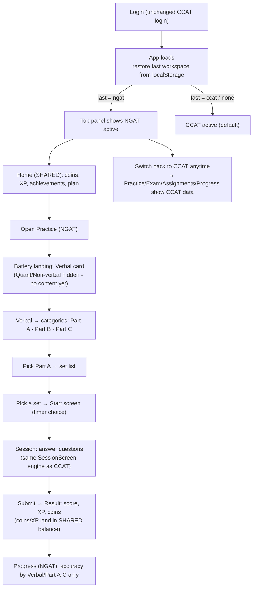

# NGAT Workspace — Phase 1 Workflow & Implementation Plan

**Project:** CCAT Practice App (monorepo `ccat-practice-app-development--new`)
**Feature:** Add **NGAT** as a second workspace inside the existing CCAT student website
**Document type:** Phase 1 plan for review — **no code has been changed yet**
**Author:** Claude (Cowork) · **Date:** 2026-10-01
**Status:** DRAFT for Ankita's review → approve before any code is written

---

## 0. How to read this document

This is the single source of truth for the NGAT build. It is intentionally detailed so that:

1. You can review and approve the approach before any code is written.
2. Whoever implements (me or a junior dev) can follow it step by step.
3. During debugging later, this file + the post-implementation `NGAT_CHANGES.md` replace having to re-scan the whole repo.

Everything below is grounded in the **actual current code** of this repo (file paths and symbol names are real). Where a number or external fact is involved it is flagged.

---

## 1. Decisions locked (your answers — 2026-10-01)

| # | Decision | Your choice | Effect on this plan |
|---|----------|-------------|---------------------|
| 1 | NGAT battery structure | **Verbal only at launch** (Part A, Part B, Part C). Quantitative & Non-verbal are hidden until content exists. | NGAT Practice/Exam shows only the Verbal battery card now; the 3-battery shell is built but the empty batteries auto-hide using the **existing** "only render batteries that have sets" logic. No new hiding code needed. |
| 2 | Default workspace on login | **Remember last used; no CCAT bias.** First-ever login defaults to CCAT. | Active workspace persisted per browser in `localStorage`; restored on load; falls back to `ccat` when nothing stored. |
| 3 | DB model for the split | **`program` column on `ccat.categories`** | NGAT gets its own `verbal/quantitative/non_verbal` category rows with `program='ngat'`. Everything downstream (sets, sessions, assignments, progress) inherits the program through the category join. Lowest-risk option. |
| 4 | Admin authoring in scope? | **Student web only** for Phase 1 | NGAT content is seeded via a SQL migration/seed for launch. Admin console gets an NGAT program scope in a **later** phase (noted in §12). |

> **Non-negotiable constraint (from brief):** the **CCAT login page is not touched.** See §9.4.

---

## 2. Current architecture (what exists today)

### 2.1 Monorepo layout (pnpm workspaces)

```
ccat-practice-app-development--new/
├── apps/
│   ├── web/        @ccat/web     — CCAT STUDENT site (Vite + React 18 + react-router v6 SPA)  ← main target
│   ├── admin/      @ccat/admin   — Admin console (React SPA; already multi-site: CCAT | TeacherHub)
│   ├── gateway/    @ccat/gateway — Fastify API; the ONLY backend the clients talk to
│   └── mobile/     @ccat/mobile  — React Native app (co-equal peer of web; out of scope for Phase 1)
└── packages/
    ├── api-client/  @ccat/api-client  — typed HTTP client + shared DTO types (CatalogItem, Mode, …)
    ├── client-core/ @ccat/client-core — framework-agnostic helpers (channel gating, titleCase, …)
    ├── contracts/   @ccat/contracts   — SQL migrations (source of truth for the DB schema) + OpenAPI
    └── shared/      @ccat/shared
```

Deployed instances confirmed live (both are SPA builds of this repo):
- Student web → `https://ccat.conceptmastery.com` (`<title>Concept Mastery — CCAT Practice</title>`)
- Admin → `https://admin.conceptmastery.com` (`<title>CCAT Admin Console</title>`)

### 2.2 How the student web works today

- `apps/web/src/main.tsx` → `BrowserRouter` → `AppProvider` (global store) → `App`.
- `App.tsx` holds the route table (`RoutesTree`) and the persistent **left `Sidebar`** (nav). Pre-auth routes (`/`, `/login`, `/register`, `/recovery`) render full-width with no sidebar.
- `lib/store.tsx` (`AppProvider`) holds cross-cutting state: `profile`, `appConfig`, `entitlements`, `activeMode` (`'practice' | 'exam' | null`), toast. **Navigation is URL-driven** (react-router), not store-driven.
- `lib/api.ts` exports a single `client` (`CcatClient` from `@ccat/api-client`) talking to `VITE_GATEWAY_URL`. Token: access in `sessionStorage`, refresh in `localStorage`.
- Screens in `apps/web/src/screens/*`. The two that matter most here:
  - `PracticeScreen.tsx` — serves **both** Practice and Exam via `?mode=`. 3-level drill-down: **Battery → Category(subcategory) → Set → Start → session**. Batteries are driven by `BATTERY_ORDER = ['verbal','quantitative','non_verbal']` + `BATTERY_VIS`. Content comes entirely from `GET /v1/catalog`, grouped client-side by `category_key → subcategory`. **Only batteries/categories that actually have sets are rendered** (see the `.filter(...reduce...>0)` on the batteries landing).
  - `ProgressScreen.tsx` — reads `GET /v1/progress/*`.

### 2.3 Content & learning data model (the important part)

Hierarchy (migration `0002_content.sql`): **Grade → Category → Subcategory → Question Set → Set Version → Question Version.** Published set/question versions are **immutable** (triggers enforce it; retire, never delete).

Everything a student does roots back to a **category** through the set:

```
categories (key: verbal|quantitative|non_verbal, UNIQUE key)
   └─ question_sets (grade_id, category_id, subcategory_id)
        └─ question_set_versions (allowed_practice, allowed_exam, state=published|retired)
             ├─ sessions (student_id, set_version_id, mode)            ← Practice/Exam runs
             │    ├─ session_answers / session_results
             │    └─ set_completions (coverage credit for Progress)
             └─ student_assignments (student_id, set_version_id)       ← Teacher → student
```

Progress aggregates (`progress.ts`) read `session_results` for the student and bucket by `category.key` using a hardcoded `CAT_ORDER = ['verbal','quantitative','non_verbal']`.

**Why this makes the chosen model clean:** because *every* learner artefact (session, assignment, completion, progress bucket) already joins up to a category, putting the `program` flag on `categories` means it propagates to **all** of them with no new columns on the busy tables.

### 2.4 Precedent: the switcher already exists in Admin

The admin app is **already multi-site**. `apps/admin/src/components/Layout.tsx`:
- `useAuth()` exposes `sites`, `activeSite`, `switchSite(id)`.
- `SITE_NAMES = { ccat: 'CCAT Practice', teacher: 'TeacherHub' }`, a pill switcher, and a `sites` DB table (`0048_sites_scoping.sql`: rows `ccat`, `teacher`).

**The screenshot you shared (`CCAT Practice | TeacherHub`) is this admin control.** The student-web NGAT switcher will mirror this pattern (a small segmented pill in the top panel), but it is a **separate, simpler** implementation (two fixed workspaces, client-side, no new auth).

---

## 3. Shared vs Separate — the core contract

Per your brief, per user:

| Capability | Shared or Separate | Where it lives / how enforced |
|-----------|--------------------|-------------------------------|
| **Profile** (name, grade, avatar, theme) | **Shared** | `ccat.students` — unscoped. One identity across both workspaces. |
| **Coins** | **Shared** | economy ledger (`lib/economy.ts`) — unscoped; coins earned in NGAT spend in CCAT and vice-versa. |
| **XP** | **Shared** | unscoped XP totals. |
| **Rewards** | **Shared** | `RewardsScreen` / rewards tables — unscoped. |
| **Plan / membership / entitlements** | **Shared** | `GET /v1/entitlements/me` — one plan unlocks both workspaces (see §7 open item on whether NGAT needs its own paywall later). |
| **Achievements** | **Shared** | achievements catalog — unscoped. |
| **Exam** | **Separate** | catalog/sessions filtered by `program`. |
| **Practice** | **Separate** | catalog/sessions filtered by `program`. |
| **Assignments** | **Separate** | `student_assignments` filtered via set→category→`program`. |
| **Progress** | **Separate** | `progress.*` computed within a single `program`. |

**Design rule that falls out of this:** anything **shared** stays exactly as-is (no `program` param). Anything **separate** gains a single `program` scoping dimension. That is the entire backend change in one sentence.

---

## 4. Target architecture (with NGAT)

### 4.1 System context



### 4.2 Data model change (ER view)



**Key:** `program` is added **only** to `categories`. `sessions` and `student_assignments` get the program for free through `set_version → set → category`. No change to those busy tables.

### 4.3 Request flow — scoped catalog call

```mermaid
sequenceDiagram
    participant U as Student
    participant W as Web SPA
    participant G as Gateway
    participant D as DB
    U->>W: Switch to NGAT (top panel)
    W->>W: setProgram('ngat') + persist to localStorage
    U->>W: Open Practice
    W->>G: GET /v1/catalog?program=ngat  (Bearer token)
    G->>D: SELECT ... JOIN categories cat ... WHERE cat.program = 'ngat'
    D-->>G: NGAT sets only
    G-->>W: catalog rows (NGAT)
    W->>W: group by category_key → subcategory; render battery cards
    Note over W: Only Verbal has sets → only Verbal card shows (existing logic)
```

---

## 5. NGAT — complete user cycle



Narrative:

1. Student logs in through the **existing** CCAT login (untouched).
2. On load the SPA restores the last-used workspace from `localStorage` (`cm_active_program`); first-ever visit → CCAT.
3. **Home, Profile, Achievements, My Plan, Bookmarks** look and behave identically in both workspaces — they read **shared** data.
4. In NGAT the student opens **Practice** → sees the 3-battery shell, but only **Verbal** is shown because only Verbal has published sets (the batteries landing already filters out empty batteries).
5. Verbal → **Part A / Part B / Part C** (NGAT subcategories) → set list → Start → **the same SessionScreen quiz engine** as CCAT (no fork).
6. On submit, **coins and XP are credited to the single shared balance**; achievements fire from the shared catalog.
7. **Progress (NGAT)** shows accuracy/coverage computed only over NGAT sessions.
8. Switching back to CCAT instantly re-scopes Practice/Exam/Assignments/Progress to CCAT data; shared screens are unaffected.

---

## 6. Implementation plan (component by component)

Ordering matters: **DB → gateway → shared types/client → web**. Each layer below lists concrete files.

### 6.1 Database (`packages/contracts/migrations/`)

**New migration `0054_ngat_program.sql`** (additive, non-breaking):

1. `ALTER TABLE ccat.categories ADD COLUMN program text NOT NULL DEFAULT 'ccat';`
2. Replace the global unique on `key` with a composite: `UNIQUE (program, key)` so NGAT can reuse `verbal` etc.
   - Current: `categories.key ... unique`. Drop that constraint, add `unique (program, key)`. Existing rows (all `program='ccat'`) stay valid.
3. (Optional, recommended) `ADD CONSTRAINT categories_program_chk CHECK (program IN ('ccat','ngat'));`
4. Index: `CREATE INDEX categories_program_idx ON ccat.categories(program);`

**New seed `packages/contracts/seed/ngat-verbal.sql`** (or a `seed-content` addition): insert NGAT category + subcategories, then grade-scoped sets:
- 1 category: `{ program:'ngat', key:'verbal', name:'Verbal Reasoning', display_order:10 }`
- 3 subcategories under it: `part_a` / `part_b` / `part_c` ("Part A/B/C").
- Grade scope: **confirm grade(s)** — NGAT is currently taught to Grade 4 (per your notes). Seed sets for the grade(s) you specify. *(This is the one content input still needed — see §11.)*

> RLS: migration `0006_rls_and_grants.sql` + `0025_rls_backfill.sql` govern row security. Adding a column does not change RLS. Verify the catalog read policy still passes after the migration (it reads published sets for the student's grade; program is just an extra filter in the query, not a new policy). **Verification step in §10.**

### 6.2 Gateway (`apps/gateway/src/routes/`)

The pattern everywhere: **read `program` from the query (default `'ccat'`), add one `AND cat.program = $program` to the JOINed query.** Shared routes are untouched.

| Route file | Change |
|-----------|--------|
| `catalog.ts` → `GET /v1/catalog` | Accept `?program`. Add `and cat.program = $program` to the main query (the `join ccat.categories cat` is already there). Default `'ccat'` so existing clients are unaffected. |
| `catalog.ts` → `GET /v1/grades` | The `practice_ready` subquery checks `cat.key in (...)`. Add `and cat.program = 'ccat'` there so CCAT grade-readiness is unchanged; add an NGAT variant later if NGAT needs its own grade picker (not needed now — registration stays CCAT). |
| `sessions.ts` → `POST /v1/sessions/start` | **No program param needed** — a session is started from a `set_version_id`, which already belongs to exactly one program via its category. The server should, however, **not** need to know the program. ✔ No change required for correctness; add a defensive note only. |
| `progress.ts` → `GET /v1/progress/*` | Accept `?program`. The finished-set query joins to categories; add `and cat.program = $program`. `CAT_ORDER` stays the same (NGAT reuses `verbal`). Default `'ccat'`. |
| `assignments.ts` → `GET /v1/assignments` | Accept `?program`. Filter assignments to those whose `set_version → set → category.program = $program`. Default `'ccat'`. |
| `bookmarks.ts` | **Shared or scoped?** Bookmarks key on `logical_question_id`, which belongs to a program via its question's category. Brief lists Bookmarks as shared UI but it is tied to content. **Decision needed — see §11 open item B.** Safe default: leave bookmarks **unscoped** (shared list), since a bookmarked NGAT question is still that student's. |

Shared/untouched routes: `account.ts`, `entitlements.ts`, `rewards.ts`, `referrals.ts`, `customization.ts`, `auth.ts`, `registration.ts`, economy.

> **Backward-compat guarantee:** every scoped endpoint defaults `program='ccat'`, so the mobile app and any un-updated client keep working with zero changes.

### 6.3 Shared types & client (`packages/api-client/src/`)

- `types.ts`: optionally add `program?: 'ccat' | 'ngat'` to `CatalogItem` (useful for debugging/telemetry; not strictly required since the client already knows which program it asked for).
- `index.ts` (`CcatClient`): thread an optional `program` arg through `catalog()`, `progressSummary()`, `progressSets()`, `assignments()`. When omitted → behaves as today (`ccat`).

### 6.4 Web — the student SPA (`apps/web/src/`)

**(a) Workspace state — `lib/store.tsx`**
Add to `AppState`:
```ts
program: 'ccat' | 'ngat';
setProgram: (p: 'ccat' | 'ngat') => void;
```
- Initialise from `localStorage.getItem('cm_active_program')`, fallback `'ccat'`.
- `setProgram` writes through to `localStorage` and updates state.
- No server call — the workspace is a client concept; the gateway only ever sees the `program` query param on scoped fetches.

**(b) The scoped screens read `program` and pass it to the client**
- `PracticeScreen.tsx`: `const { program } = useApp();` → `client.catalog(program)`. **No other change** to the 3-level drill-down; `BATTERY_ORDER`/`BATTERY_VIS` already key on `verbal` so NGAT Verbal renders with the same visuals. Empty NGAT batteries auto-hide via the existing filter. Works for **both** Practice and Exam (same file).
- `ProgressScreen.tsx`: pass `program` to the progress calls.
- `AssignmentsScreen.tsx` + `Sidebar.tsx` assignment badge: pass `program` to `client.assignments(program)`.
- `HomeScreen.tsx`: Home is shared, but its "continue practising / recent" widgets read catalog/progress. **Decision:** Home should reflect the **active workspace** for its practice widgets while keeping shared coins/XP/achievements. Pass `program` to the practice/progress parts only.

**(c) The switcher UI — top panel**
- New component `components/WorkspaceSwitch.tsx`: a segmented pill `[ CCAT · NGAT ]` mirroring the admin's visual. On click → `setProgram(x)` and, if currently on a **scoped** route, `navigate` to that route's base (e.g. stay on `/practice` but it refetches) — switching program while on `/progress` just refetches `/progress` for the new program.
- **Placement:** the brief says "top panel." Today the student web has a **left Sidebar**, not a top bar, plus a mobile hamburger. Two options (see §11 open item C): **(C1)** add a slim top strip containing only the switcher on in-app pages, or **(C2)** place the switcher at the top of the existing Sidebar header (and in the mobile drawer), which is less layout churn and matches where the admin keeps it. **Recommended: C2** unless you specifically want a full-width top bar.
- Reset-on-switch rule: switching program should drop any in-progress drill-down query params (`?battery=&category=&set=`) so the student lands on the battery landing of the new workspace.

**(d) Routing — `App.tsx`**
- **No new routes.** The same routes (`/practice`, `/progress`, `/assignments`, `/session/:id`, `/result/:id`) serve both workspaces; the data differs by `program`. This keeps deep links and the SessionScreen engine identical.
- A session opened in NGAT uses the same `/session/:id`; the session already knows its set/program server-side, so results/replay work unchanged.

**(e) Branding in the workspace**
- Sidebar brand sub-label currently reads "CCAT Practice". Make it reflect the active workspace ("CCAT Practice" / "NGAT Practice"). Trivial, string from `program`.

### 6.5 What is explicitly NOT changed in Phase 1

- **CCAT login page** (`LoginScreen.tsx`) and all pre-auth routes — untouched (§9.4).
- **Admin console** — no NGAT authoring yet (your decision #4). NGAT content is seeded by migration.
- **Mobile app** — not in scope; it keeps calling the gateway without a `program` param and therefore sees CCAT, exactly as today.
- Economy, rewards, achievements, entitlements, referrals — untouched (shared).

---

## 7. Shared-vs-separate — enforcement summary (one table)

| Layer | Shared (unchanged) | Separate (gains `program`) |
|-------|--------------------|-----------------------------|
| DB | `students`, economy, rewards, achievements, entitlements tables | `categories.program`; everything else inherits via join |
| Gateway | `/v1/profile`, `/v1/entitlements/me`, `/v1/rewards/*`, economy | `/v1/catalog`, `/v1/progress/*`, `/v1/assignments` (+`?program`) |
| Client | profile/entitlements/rewards calls | `catalog/progress/assignments` calls take `program` |
| Web | Home shell, Profile, Achievements, My Plan, Bookmarks | Practice, Exam, Progress, Assignments screens |

---

## 8. Implementation steps (ordered checklist)

> Each step is independently reviewable. I do all of this; items needing you are flagged ⚠️.

**Stage A — Database**
1. Write `0054_ngat_program.sql` (column + composite unique + check + index).
2. Write `ngat-verbal.sql` seed (category + Part A/B/C + grade-scoped sets). ⚠️ needs grade + sample content (§11-A).
3. Run migration locally (`pnpm migrate`) against the docker DB; confirm CCAT catalog unchanged.

**Stage B — Gateway**
4. Add `program` param to `catalog.ts`, `progress.ts`, `assignments.ts` (default `ccat`).
5. Gateway tests: extend existing catalog/progress tests with a `program=ngat` case; confirm `program=ccat`/omitted is byte-identical to before.

**Stage C — Shared client**
6. Thread optional `program` through `@ccat/api-client` methods; typecheck the workspace.

**Stage D — Web**
7. Add `program`/`setProgram` to `store.tsx` with localStorage persistence.
8. Build `WorkspaceSwitch.tsx`; mount in Sidebar header + mobile drawer (C2) — ⚠️ confirm placement (§11-C).
9. Wire `program` into PracticeScreen, ProgressScreen, AssignmentsScreen, Sidebar badge, Home practice widgets.
10. Brand sub-label reflects active workspace.

**Stage E — Verify (see §10)**
11. Local E2E: switch to NGAT → Practice shows only Verbal → Part A/B/C → run a set → coins/XP land in shared balance → Progress(NGAT) isolated → switch to CCAT → CCAT data intact.
12. Regression: CCAT behaves exactly as before with the switcher ignored.

**Stage F — Handoff**
13. Produce `NGAT_CHANGES.md` (post-implementation reference — see §13).
14. ⚠️ **You** run the migration on production Supabase and **you** do the git push (per brief). I provide exact commands.

---

## 9. Design rationale & key choices

### 9.1 Why `program` on `categories` (not a new `programs` table / FK everywhere)
Every learner artefact already joins to a category. One column propagates the split to sessions, assignments, completions, and progress **without touching those tables**. A `programs` table with explicit FKs on 4+ busy tables is more migration surface and more RLS surface for zero functional gain at this scale. If NGAT later needs per-program config/branding rows, a lookup table can be added then without reworking this.

### 9.2 Why no new routes / one PracticeScreen
`PracticeScreen` is already parameterised (`?mode=`) and fully catalog-driven. Adding `program` as a data filter — not a code fork — means NGAT inherits every future Practice/Exam fix automatically and there is no duplicated screen to keep in sync.

### 9.3 Why the empty NGAT batteries need no special code
The batteries landing already renders only batteries whose set count > 0. With only Verbal seeded, only Verbal shows. When you later add NGAT Quant/Non-verbal content, those cards appear automatically — no code change.

### 9.4 Login untouched — how that is guaranteed
The workspace concept lives entirely **after** auth: `program` state is only read by in-app scoped screens, and the switcher only mounts on authenticated pages (same condition as the Sidebar: `showSidebar` in `App.tsx`). `LoginScreen.tsx`, `/login`, and the auth flow get **no edits**.

### 9.5 Backward compatibility
Every scoped endpoint defaults `program='ccat'`. The mobile app and any cached web build keep working unchanged and see CCAT. This also means the change can ship behind nothing more than the presence of the switcher.

---

## 10. Verification plan (how we prove it works)

| Check | Method | Pass criteria |
|-------|--------|---------------|
| Migration safe | Run `0054` on a copy of the DB | No error; all existing `categories` rows now `program='ccat'`; CCAT catalog query returns the same rows as before |
| CCAT regression | Local web, never touch switcher | Practice/Exam/Progress/Assignments identical to pre-change |
| NGAT isolation | Switch to NGAT | Practice shows only Verbal → Part A/B/C; Progress(NGAT) shows only NGAT sessions |
| Shared balances | Finish an NGAT set | Coins/XP/achievements update in the **same** balance visible in CCAT |
| Persistence | Switch to NGAT, reload | App reopens in NGAT |
| First-visit default | Clear localStorage, reload | App opens in CCAT |
| Deep link | Open `/session/:id` for an NGAT session | Loads and scores correctly |
| Gateway contract | Tests with `program` omitted / `=ccat` / `=ngat` | omitted == ccat; ngat returns only NGAT rows |

For the DB/gateway regression I will diff query outputs before/after on the local docker DB. For the UI I will run the web dev server and walk the full cycle (screenshots in the handoff doc).

---

## 11. Open items — I need a decision / input from you

- **A. NGAT content & grade (blocking the seed).** What grade(s) should the launch NGAT Verbal sets target, and do you have the actual questions (or should I generate placeholder sets, 5–20 Q each per Part A/B/C, so the flow is testable and you replace them later)? *Your call; nothing else is blocked by this.*
- **B. Bookmarks — shared or program-scoped?** Brief lists Bookmarks under shared UI. Recommendation: keep the bookmark **list shared** (a student's saved questions, regardless of program). Confirm, or say you want it split per workspace.
- **C. Switcher placement.** C1 = a new slim top bar (matches the literal words "top panel") vs **C2 = switcher in the existing Sidebar header + mobile drawer (recommended, less layout churn, matches admin).** Which do you want?
- **D. My Plan / paywall.** One shared plan unlocks both workspaces (current assumption). If NGAT should eventually have its own entitlement/paywall, say so and I'll leave a seam for it (but not build it in Phase 1).

*(None of these block writing the code for the switcher, store, gateway params, or migration column. A and C are the only ones that affect what the first running build looks like.)*

---

## 12. Things only you can do (I cannot)

- **Run the production migration** on Supabase and **push to Git** — per your brief, you handle Git; I will hand you the exact `git` and migration commands and the migration/seed files.
- Provide real NGAT question content (or approve placeholder generation) — §11-A.
- Confirm the four open items in §11.

---

## 13. Post-implementation reference (the second Markdown)

After the code is written and verified, I will produce **`NGAT_CHANGES.md`** at the repo root documenting, per your brief:
- What changed (file-by-file, with the migration number)
- Features added and their completion status
- How each feature works
- Shared vs separate (final, as-built)
- Pending work / known issues

That file becomes the debugging/continuation reference so the repo doesn't need re-scanning next time.

---

## 14. Summary for review

- **One DB column** (`categories.program`) carries the entire CCAT/NGAT split; busy tables untouched.
- **Three gateway endpoints** gain an optional `program` param (default `ccat` = zero regression).
- **The student web gains one state field, one switcher component, and `program` wired into 4 scoped screens.** No new routes, no forked screens, login untouched.
- **NGAT launches Verbal-only**; the 3-battery shell is built and the empty batteries auto-hide until you add content.
- **Shared** (profile/coins/XP/rewards/plan/achievements) is genuinely one set of data across both workspaces; **separate** (practice/exam/assignments/progress) is cleanly scoped.

**Awaiting your approval + answers to §11 (A and C especially) before I write any code.**
